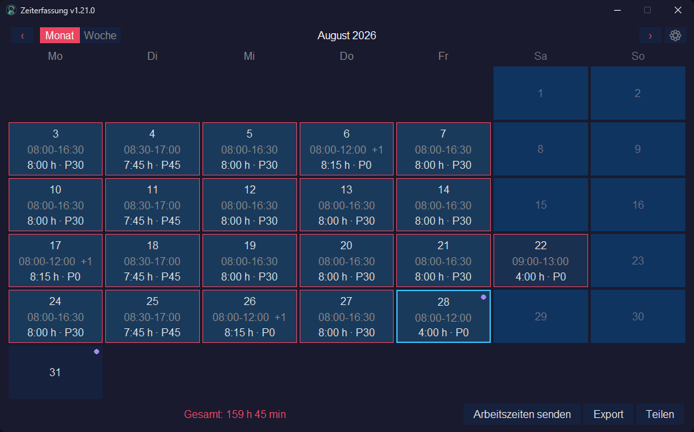
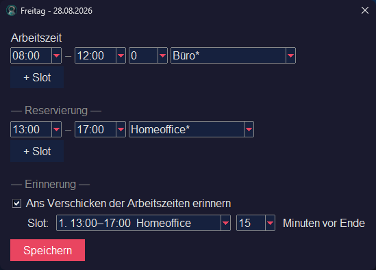
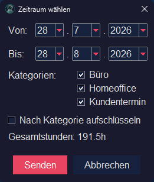
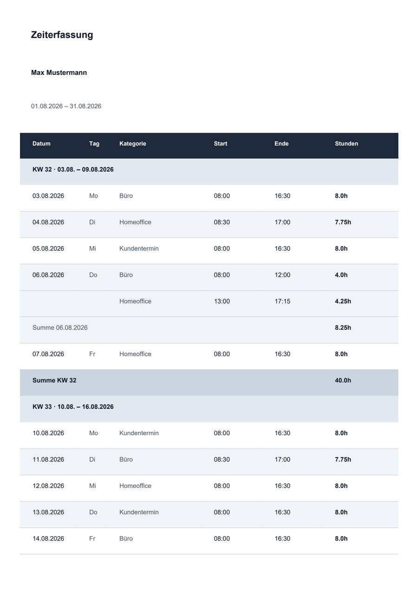
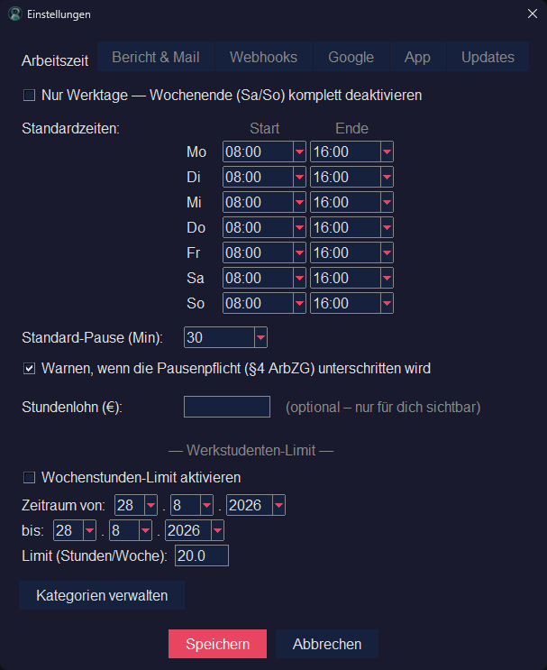

<h1>
  
  Zeiterfassung
</h1>

> [!NOTE]
> **Hier wird die Zeiterfassung weiterentwickelt.** Bis einschließlich `1.21.0`
> lag das Projekt unter
> [margenheld/Zeiterfassung](https://github.com/margenheld/Zeiterfassung); dort
> bleiben die älteren Releases samt Downloads und die Issue-Historie dauerhaft
> erreichbar.
>
> **Wer noch eine Version vor `1.21.0` nutzt, aktualisiert einmalig über das
> alte Repository** — ab `1.21.0` meldet die App neue Versionen automatisch von
> hier. Neue Releases erscheinen ausschließlich in diesem Repository.

Desktop-App zur Erfassung von Arbeitszeiten mit Kalenderansicht, PDF-Report und automatischem Gmail-Versand.

[](https://github.com/Xveyn/Zeiterfassung/releases/latest)   [](LICENSE)



<sub>Alle Screenshots stammen aus Version 1.21.0 — die Version steht im Dateinamen (`…-v1.21.0.png`), siehe [`docs/screenshots/`](docs/screenshots/).</sub>

## Inhalt

[Features](#features) · [Installation](#installation) · [Projektstruktur](#projektstruktur) ·
[Gmail API](#gmail-api-einrichten) · [Multi-Device-Sync](#multi-device-sync-einrichten-optional) ·
[Google-Kalender](#google-kalender-für-reservierungen-einrichten-optional) ·
[Einstellungen](#einstellungen) · [Build](#build) ·
[Plattform-Kompatibilität](#plattform-kompatibilität) · [Tests](#tests) ·
[Datenspeicherung](#datenspeicherung) · [Lizenz](#lizenz)

## Features

### Zeiten erfassen

- **Kalenderansicht** — Monats- und Wochenansicht mit Tageseinträgen (Start, Ende, Pause) und Netto-Stunden je Tag; Stunden durchgehend in Stunden/Minuten statt dezimal
- **Kategorien** — Mehrere Zeitblöcke pro Tag mit eigenen Kategorien; Standard-Start/-Ende pro Kategorie, optional pro Wochentag
- **Reservierungen & Google-Kalender** — Zukünftige Arbeitszeiten pro Tag reservieren (eigenes Konzept neben den Ist-Zeiten, im Kalender als violetter Eck-Punkt markiert); optionaler Abgleich mit einem wählbaren Google Kalender
- **Reservierungs-Erinnerungen** — Optionale Toast-Benachrichtigung, wenn ein für heute reservierter Slot fällig wird und noch keine Ist-Zeit erfasst ist (konfigurierbare Vorlaufzeit)
- **Feiertage** — Feiertage des gewählten Bundeslands sind im Kalender markiert und werden beim Anlegen eines Eintrags nachgefragt
- **Nur Werktage** — Optional lässt sich das Wochenende komplett deaktivieren: Sa/So verschwinden aus Kalender, Standardzeiten, Bericht, Mailversand und PDF-Export. Vorhandene Wochenend-Einträge bleiben gespeichert und sind sofort wieder da, wenn die Einstellung zurückgenommen wird
- **Wochenstunden-Limit** — Optionales Werkstudenten-Limit über einen konfigurierbaren Zeitraum mit Warnung beim Überschreiten
- **Pausenpflicht-Warnung** — Hinweis beim Speichern, wenn die eingetragene Pause die gesetzliche Mindestpause nach § 4 ArbZG unterschreitet (30 Min ab >6 h, 45 Min ab >9 h); standardmäßig aktiv, abschaltbar. Grobe Näherung, keine rechtliche Bewertung



*Ein Tag im Detail: erfasste Ist-Zeit, geplante Reservierung und die Erinnerung ans Verschicken. Linksklick auf einen Kalendertag öffnet den Dialog; gelöscht wird im Kalender selbst (Rechtsklick, unter macOS über das ✕ in der Tageszelle).*

### Berichten & verschicken

- **PDF-Report** — Automatische Generierung als druckfreundliches PDF, gruppiert pro ISO-Kalenderwoche; Kategorie-Aufschlüsselung optional
- **E-Mail-Versand** — HTML-E-Mail mit PDF-Anhang über Gmail API (OAuth2)
- **Webhook-Versand** — Der Bericht lässt sich zusätzlich zur E-Mail an konfigurierbare HTTP-Endpunkte senden (JSON und/oder PDF, optional mit Token oder HMAC-Signatur); gerätelokal konfiguriert
- **PDF-Export** — Bericht für einen frei gewählten Zeitraum direkt als PDF lokal speichern (ohne Mail-Versand)
- **Zeitraumwahl** — Flexibler Datumsbereich für Reports, mit Filter auf einzelne Kategorien
- **Sende-Erinnerung** — Optionale Toast-Erinnerung, die Arbeitszeiten zu verschicken: monatlich an einem frei wählbaren Tag (auf Wunsch von Wochenenden und Feiertagen weg verschoben) und/oder tagesbezogen, wenn ein dafür markierter Reservierungs-Slot ausläuft. Der Sende-Dialog schlägt den Zeitraum seit der letzten Erinnerung vor
- **Teilen & Importieren** — Eigene Arbeitszeiten als JSON-Anhang per Mail an eine zweite Person teilen; der Empfänger importiert sie mit Zeitraum-Filter und drei Konflikt-Modi (alles importieren / alles lokal / pro Tag entscheiden)



*Der Sende-Dialog: Zeitraum, Kategorie-Filter und die Gesamtstunden vor dem Absenden.*



*Der erzeugte PDF-Bericht — pro ISO-Kalenderwoche gruppiert, mit Tages- und Wochensummen.*

### App & Umgebung

- **Multi-Device-Sync** — Optionale Synchronisation von Zeiteinträgen und Mail-Vorlagen über Google Drive (`appDataFolder`), inklusive Konflikt-Auflösung wenn dasselbe Datum offline auf mehreren Geräten bearbeitet wurde — per Linksklick direkt auf den betroffenen Kalendertag oder gesammelt in den Einstellungen
- **Einstellungen** — In Tabs gegliedert (Arbeitszeit / Bericht & Mail / Google / App / Webhooks / Updates); E-Mail-Vorlagen mit Platzhaltern, Standardpause, Empfänger und Update-Einstellungen
- **Autostart & Einzelinstanz** — Optionaler minimierter Start bei Anmeldung (Windows, macOS, Linux); es läuft immer nur eine Instanz — ein zweiter Start holt das vorhandene Fenster nach vorn
- **Update-Check** — Konfigurierbare Hintergrund-Prüfung auf neue Releases; Updates-Tab mit manuellem Check, Changelog und Direkt-Download, bei aktivem Tray als einmaliger Toast statt Banner. Läuft die App im Infobereich, stößt **„Nach Updates suchen"** im Tray-Menü die Prüfung direkt an — das Ergebnis kommt als Toast, auch wenn alles aktuell ist. Optional lassen sich auch Vorabversionen (Pre-Releases) anbieten — Testbuilds vor dem echten Release
- **Dark Mode UI** — Modernes dunkles Design, für alle Dialoge einheitlich
- **UI-Skalierung** — Stufenloser Skalierungsfaktor für die Oberfläche (gerätelokal)
- **Cross-Platform-Installer** — Per PyInstaller gebaut, als Setup-Exe (Windows), DMG (macOS) und AppImage (Linux) paketierbar



*Die Einstellungen, hier der Tab „Arbeitszeit" mit Standardzeiten, Pausenpflicht und Werkstudenten-Limit.*

## Installation

### Fertige Releases

Vorgefertigte Installer für alle drei Plattformen gibt es unter [Releases](../../releases):

**Windows**
Lade `Zeiterfassung_Setup.exe` und führe den Installer aus. App installiert nach `%LOCALAPPDATA%\Programs\Zeiterfassung\`.

**macOS** (Apple Silicon)
Lade `Zeiterfassung-<ver>-arm64.dmg` herunter. Öffne das DMG und ziehe die App in den Applications-Ordner. Beim ersten Start: Rechtsklick auf die App → „Öffnen" (Gatekeeper-Warnung bestätigen), oder im Terminal:

```bash
xattr -dr com.apple.quarantine /Applications/Zeiterfassung.app
```

Der Build ist nicht signiert — dieser Schritt ist einmalig nötig.

**Linux**
Lade `Zeiterfassung-<ver>-x86_64.AppImage` herunter:

```bash
chmod +x Zeiterfassung-<ver>-x86_64.AppImage
./Zeiterfassung-<ver>-x86_64.AppImage
```

Voraussetzung: `libfuse2` installiert (`sudo apt install libfuse2` unter Debian/Ubuntu).

Beim ersten Start legt die App einen Eintrag im Anwendungsmenü an
(`~/.local/share/applications/Zeiterfassung.desktop`) und hält ihn danach
automatisch aktuell. Dasselbe gilt für den Autostart, falls aktiviert: beide
zeigen nach einem Update von selbst auf die neue AppImage — vorausgesetzt, du
startest die neue Datei einmal. Ein Integrationswerkzeug wie `appimaged` wird
nicht gebraucht.

### Aus dem Source-Code

#### Voraussetzungen

- Python 3.10+
- Windows 10/11, macOS 12+ oder Linux (mit Tkinter)

#### Linux: Tkinter installieren

Tkinter ist unter Linux nicht immer vorinstalliert:

```bash
# Debian / Ubuntu
sudo apt install python3-tk

# Fedora
sudo dnf install python3-tkinter

# Arch
sudo pacman -S tk
```

#### Setup

```bash
# Repository klonen
git clone https://github.com/Xveyn/Zeiterfassung.git
cd Zeiterfassung

# Abhängigkeiten installieren
pip install -r requirements.txt

# App starten
python -m src.main
```

#### Abhängigkeiten

| Paket | Zweck |
|-------|-------|
| `google-auth-oauthlib` | OAuth2-Authentifizierung für Gmail |
| `google-api-python-client` | Gmail API Client |
| `xhtml2pdf` | PDF-Generierung aus HTML |
| `pyinstaller` | Paketierung als Standalone-Binary |
| `holidays` | Feiertags-Lookup (deutsche Feiertage) |
| `pystray` | Infobereich-Icon (Minimize-to-Tray) |
| `Pillow` | Icon-/Bildverarbeitung (Tray-Icon) |
| `pyobjc-framework-Cocoa` | Natives macOS-Tray (nur macOS) |

## Projektstruktur

> Detaillierte Architektur — die `App`-Komponenten (`GridRenderer`, `BackgroundTaskRunner`, `SyncOrchestrator`, `UpdateBanner`), ihre Verträge und das Threading-Modell: [`src/CLAUDE.md`](src/CLAUDE.md).

<details>
<summary>Verzeichnisbaum mit Kurzbeschreibung je Modul</summary>

```
Zeiterfassung/
├── src/
│   ├── main.py            # Einstiegspunkt
│   ├── ui.py              # Tkinter-GUI; App koordiniert die Komponenten (Chrome, Navigation, Dialog-Routing)
│   ├── grid_renderer.py   # Kalender-/Grid-Rendering (Monats-/Wochenansicht, Zelltypen, Double-Buffer)
│   ├── background_tasks.py # Hintergrund-Worker + Thread-Mechanik (Token-Refresh, Update-Check, Reconcile)
│   ├── sync_orchestrator.py # Drive-Sync-Steuerung (manuell/Tray/Pull/Quit, Fehler-Aufbereitung)
│   ├── update_banner.py   # GitHub-Release-Hinweis-Banner
│   ├── dialogs/           # Modal-Dialoge (entry, send, export, settings, share, import, conflicts, category, scopes, webhook) + geteilter period_picker
│   ├── storage.py         # JSON-Persistenz der Zeiteinträge
│   ├── settings.py        # Einstellungen mit Standardwerten
│   ├── category_defaults.py # Default-Kategorien für Zeit-Slots
│   ├── report.py          # HTML- & PDF-Reportgenerierung
│   ├── mail.py            # Gmail OAuth2-Authentifizierung & Versand
│   ├── webhook.py         # Webhook-Versand (URL-Prüfung, Auth/HMAC, Payload, POST), pure Logik
│   ├── webhook_store.py   # Gerätelokale Persistenz der Webhooks (gehärtet geschrieben, kein Sync)
│   ├── drive.py           # Google Drive API-Wrapper (Multi-Device-Sync)
│   ├── sync.py            # Sync-Engine (pure Logik, LWW-Merge, Konflikterkennung)
│   ├── sync_journal.py    # Crash-Recovery für den Sync-Apply (Write-Ahead-Journal)
│   ├── sync_history.py    # Persistenter „hat je gesynct/abgeglichen"-Marker (Tombstone-Schutz)
│   ├── conflicts_store.py # Lokale Persistenz der Konfliktliste
│   ├── share.py           # Export/Import von Arbeitszeiten als Share-JSON
│   ├── reservations.py    # Reservierungen (zukünftige Soll-Zeiten)
│   ├── reservations_sync.py # Abgleich der Reservierungen mit Google Kalender
│   ├── reminders.py       # Fälligkeits-Logik für Reservierungs-Erinnerungen (Tk-frei)
│   ├── reminder_scheduler.py # Periodischer Reminder-Poll → Toast über Tray
│   ├── send_reminder.py   # Fälligkeits-Logik des Sende-Reminders: monatlich + am markierten Slot (Tk-frei)
│   ├── send_reminder_scheduler.py # Periodischer Poll über beide Kanäle → Sende-Toast
│   ├── weekly_limit.py    # Wochenstunden-Limit (Werkstudenten-Privileg), pure Logik
│   ├── pause_requirement.py # Pausenpflicht-Check nach § 4 ArbZG, pure Logik
│   ├── workweek.py        # Nur-Werktage-Modus (Sa/So ausblenden), pure Logik
│   ├── gcal.py            # Google-Calendar-API-Wrapper
│   ├── oauth_utils.py     # Gemeinsame OAuth-Token-Boilerplate (Persistenz, Scope-Upgrade) für mail/drive/gcal
│   ├── tray.py            # Infobereich-Icon (Minimize-to-Tray); Plattform-Fassade
│   ├── tray_mac.py        # Natives macOS-Tray-Backend (NSStatusItem, dormant/opt-in)
│   ├── tray_linux.py      # Linux-Tray-Backend (StatusNotifierItem über D-Bus, dormant/opt-in)
│   ├── autostart.py       # Plattformabhängiger Autostart (Windows-Registry/macOS/Linux)
│   ├── desktop_entry.py   # Freedesktop-.desktop-Eintrag + Icon-Kopie (Linux-Anwendungsmenü)
│   ├── secure_file.py     # Zugriffsschutz für lokale Secrets (Windows-ACL via icacls)
│   ├── single_instance.py # Single-Instance-Guard (verhindert parallele Instanzen)
│   ├── device_id.py       # Stabile, hardware-abgeleitete Geräte-ID für installierte Builds (Sync)
│   ├── updater.py         # GitHub-Releases-Check (stdlib-only, Frequenz konfigurierbar)
│   ├── changelog.py       # Lädt/parst den Changelog-Abschnitt einer Release-Version
│   ├── holidays_de.py     # Feiertags-Lookup (python-holidays)
│   ├── time_utils.py      # Zeitberechnung und Validierung
│   ├── logging_setup.py   # File-Logging + globaler Excepthook
│   ├── platform_open.py   # os.startfile/open/xdg-open-Wrapper
│   ├── theme.py           # Theme-/Font-Konstanten
│   ├── tooltip.py         # Tooltip-Helfer
│   ├── version.py         # Einzige Quelle der App-Version
│   └── paths.py           # Pfadauflösung (Script- vs. Frozen-Modus)
├── tests/                 # pytest-Testdateien
├── assets/
│   └── margenheld-icon    # App-Icon (.png + .ico + .icns)
├── docs/                  # Specs/Plans, Known Limitations
├── scripts/               # Entwickler-Skripte (nicht Teil der App)
│   ├── build.py           # Plattform-Dispatcher für den PyInstaller-Build
│   └── webhook_testserver.py  # lokaler Test-Empfänger für den Webhook-Versand
├── installer.iss          # Inno Setup Script (Windows-Installer)
├── requirements.txt       # Python-Abhängigkeiten (App-Laufzeit, exakt gepinnt)
├── requirements-test.txt  # Test-/CI-Abhängigkeiten (pytest & Co., exakt gepinnt)
├── pyproject.toml         # Konfiguration für ruff, pytest, coverage und pyright
├── settings.json          # Benutzereinstellungen (wird automatisch erstellt)
└── zeiterfassung.json     # Gespeicherte Zeiteinträge (wird automatisch erstellt)
```

</details>

## Gmail API einrichten

Damit die App E-Mails versenden kann, muss einmalig ein Google Cloud Projekt mit Gmail API eingerichtet werden.

### 1. Google Cloud Projekt erstellen

1. [Google Cloud Console](https://console.cloud.google.com/) öffnen
2. Projekt-Dropdown → **Neues Projekt** → Name: "Zeiterfassung" → **Erstellen**

### 2. Gmail API aktivieren

1. **APIs & Dienste** → **Bibliothek**
2. Nach "Gmail API" suchen → **Aktivieren**

### 3. OAuth-Zustimmungsbildschirm (Google Auth Platform)

Google hat die OAuth-Konfiguration 2025 unter **Google Auth Platform** zusammengezogen (früher „OAuth-Zustimmungsbildschirm" unter APIs & Dienste).

1. **Menü ☰ → Google Auth Platform** öffnen (oder direkt [console.cloud.google.com/auth/overview](https://console.cloud.google.com/auth/overview))
2. Falls noch nicht konfiguriert: **Jetzt starten** / **Get Started** klicken
3. **Branding**: App-Name "Zeiterfassung" + Support-E-Mail (deine Gmail-Adresse)
4. **Zielgruppe / Audience**: Nutzertyp **Extern** wählen
5. **Kontaktinformationen**: deine E-Mail-Adresse für Benachrichtigungen
6. Datenschutzbedingungen akzeptieren → **Erstellen / Finish**
7. Anschließend unter **Zielgruppe / Audience → Testnutzer → Nutzer hinzufügen**: deine Gmail-Adresse eintragen

Die Scopes werden nicht hier, sondern unter **Data Access** vergeben — entweder fügt sie der Consent-Flow beim ersten Versand automatisch hinzu, oder du trägst sie manuell ein (siehe Hinweis unten und den Sync-/Kalender-Abschnitt). Für reinen Gmail-Versand reichen `gmail.send` und `userinfo.email`.

- `userinfo.email` wird benötigt, damit die App die Absender-E-Mail-Adresse automatisch aus dem Google-Konto übernehmen kann (non-sensitive, keine Verifizierung nötig)

### 4. OAuth2 Client-ID erstellen

1. **Menü ☰ → Google Auth Platform → Clients** → **Client erstellen** (alternativ weiterhin unter **APIs & Dienste → Anmeldedaten → Anmeldedaten erstellen → OAuth-Client-ID**)
2. Anwendungstyp: **Desktop-App** → Name: "Zeiterfassung" → **Erstellen**
3. **JSON herunterladen** → als `credentials.json` speichern:
   - **Entwicklung (aus dem Source):** im Projekt-Root
   - **Windows (installiert):** `%LOCALAPPDATA%\Programs\Zeiterfassung\`
   - **macOS (installiert):** `~/Library/Application Support/Zeiterfassung/`
   - **Linux (AppImage):** `~/.local/share/Zeiterfassung/` (oder `$XDG_DATA_HOME/Zeiterfassung/`)

### 5. Erster Versand

1. App starten
2. Unter **Einstellungen** (⚙) E-Mail und Empfänger eintragen
3. **Arbeitszeiten senden** klicken
4. Browser öffnet sich → mit Google anmelden → Zugriff erlauben (bei unverifizierter App: **Erweitert → „Zu Zeiterfassung (unsicher)"**)
5. `token.json` wird automatisch erstellt

### Hinweise

- **Test-Modus läuft alle 7 Tage ab:** Solange das Cloud-Projekt den Veröffentlichungsstatus **„Testing"** hat und Scopes über `userinfo.email`/`profile` hinaus anfordert (Gmail, Drive, Kalender — also bei dieser App immer), widerruft Google den Refresh-Token nach **7 Tagen** ([Google-Doku](https://developers.google.com/identity/protocols/oauth2)). Folge: ungefähr wöchentlich öffnet sich der Anmelde-Browser erneut.
  - **Abhilfe:** Unter **Google Auth Platform → Zielgruppe / Audience** den Status auf **„In Produktion"** setzen. Dann bleibt der Refresh-Token langlebig. Für rein **private** Nutzung ist **keine** Google-Verifizierung nötig — die App bleibt „nicht verifiziert" (Warnscreen beim ersten Login, Limit 100 Nutzer), funktioniert aber dauerhaft ohne wöchentliche Neuanmeldung.
- Im Test-Modus können sich nur eingetragene **Testnutzer** authentifizieren (deine eigene Gmail-Adresse zählt mit)
- Innerhalb der Token-Gültigkeit wird der Access-Token automatisch erneuert; läuft der Refresh-Token ab, öffnet sich der Browser erneut
- Welche Berechtigungen dein Konto der App tatsächlich gewährt hat, zeigt die App unter **Einstellungen → Google → Berechtigungen** — die Kontrolle nach dem Setup und nach jedem Zuschalten von Sync oder Kalender
- `credentials.json` und `token.json` gehören **nicht** ins Repository

## Multi-Device-Sync einrichten (optional)

Wer die App auf mehreren Geräten (z. B. Büro-PC und Privat-Laptop) mit demselben Google-Konto nutzt, kann Zeiteinträge und Mail-Vorlagen automatisch synchronisieren. Die Sync-Datei liegt in einem **versteckten App-Ordner** in deinem Google Drive (`appDataFolder`) — sie taucht nicht in der normalen Drive-Ansicht auf und ist nur für diese App lesbar.

**Voraussetzung:** Gmail API ist bereits eingerichtet (siehe Abschnitt oben). Die Sync-Funktion erweitert das bestehende OAuth-Setup nur um einen zusätzlichen Scope.

### 1. Google Drive API aktivieren

1. [Google Cloud Console](https://console.cloud.google.com/) öffnen, dein bestehendes Zeiterfassungs-Projekt wählen
2. **APIs & Dienste** → **Bibliothek**
3. Nach "Google Drive API" suchen → **Aktivieren**

### 2. drive.appdata-Scope hinzufügen

Google hat die OAuth-Konfiguration 2025 unter **Google Auth Platform** zusammengezogen. Direkt-Link zur Scope-Seite:

```
https://console.cloud.google.com/auth/scopes
```

Oder manuell: **Menü ☰ → Google Auth Platform → Data Access**.

1. **Bereiche hinzufügen oder entfernen** klicken
2. Im Filter `drive.appdata` eintippen
3. Häkchen bei `.../auth/drive.appdata` (Google Drive API) setzen — Beschreibung: „Eigene Konfigurationsdaten in Google Drive abrufen, erstellen und löschen"
4. **Aktualisieren** klicken → der Scope landet unter „Nicht vertrauliche Bereiche" (keine Verifizierung nötig — `drive.appdata` ist Non-Sensitive)

### 3. Bestehendes Token verwerfen

Solange die alte `token.json` (nur mit `gmail.send`-Scope) existiert, läuft kein neuer Consent-Flow. Datei löschen:

- **Windows (installiert):** `%LOCALAPPDATA%\Programs\Zeiterfassung\token.json`
- **macOS (installiert):** `~/Library/Application Support/Zeiterfassung/token.json`
- **Linux (AppImage):** `~/.local/share/Zeiterfassung/token.json`
- **Entwicklung (Source):** `token.json` im Projekt-Root

### 4. Sync in der App aktivieren

1. App starten → Einstellungen (⚙) öffnen
2. Sektion **Synchronisation** ganz unten → Checkbox **„Mit Google Drive synchronisieren"** anhaken
3. Browser öffnet sich → mit Google anmelden → der Consent-Screen zeigt jetzt **zwei** Berechtigungen:
   - „E-Mails über dein Konto senden" (Gmail, bestehend)
   - „Eigene Konfigurationsdaten in deinem Google Drive einsehen und verwalten" (Drive appdata, neu)
4. Beiden zustimmen → im Header erscheint rechts ein `⟳`-Button und ein Status-Label

Wiederhole Schritte 3-4 auf jedem weiteren Gerät mit demselben Google-Konto.

### Wie der Sync funktioniert

- **Pull beim App-Start** — sobald Sync aktiv und Netz da ist, werden Drive-Änderungen anderer Geräte im Hintergrund eingespielt
- **Push beim App-Schließen** — lokale Änderungen werden vor dem Beenden hochgeladen (5s Timeout)
- **Manueller Sync** — der `⟳`-Button im Header triggert sofortigen Push
- **Konflikte** — wird ein Tag offline auf zwei Geräten unterschiedlich bearbeitet, erscheint nach dem Sync ein Warn-Icon auf dem Tag und ein „⚠ N Konflikte"-Status. Klick auf **Konflikte ansehen** in den Einstellungen öffnet einen Dialog, in dem du Version A, B oder einen eigenen Wert übernehmen kannst

### Hinweise zum Sync

- **Geräte-ID** — jede Installation bekommt beim ersten Start eine eindeutige ID. Installierte Builds leiten sie aus einer stabilen System-ID des Rechners ab (gehasht, siehe `src/device_id.py`) — sie übersteht damit eine Neuinstallation der App; im Repo-/Skript-Modus bleibt es bei einer in `settings.json` gespeicherten Zufalls-UUID. Im Konflikt-Dialog siehst du, von welchem Gerät die jeweilige Version kommt.
- **Was synchronisiert wird:** Zeiteinträge + Mail-Vorlagen-Settings (Empfänger, Name, Stundensatz, Betreff, Begrüßung, Inhalt, Grußformel). Gerätespezifisches (Autostart, Standardzeiten pro Wochentag, Update-Einstellungen/-Status) bleibt lokal.
- **Wo die Sync-Datei liegt:** Im versteckten `appDataFolder` deines Google Drives — nicht über `drive.google.com` einsehbar, nur diese App kommt dran.
- **Test-Modus:** Solange dein Cloud-Projekt im Test-Modus bleibt, müssen alle Nutzer (deine eigenen Geräte zählen mit deiner E-Mail) als Testnutzer eingetragen sein. Verifizierung durch Google ist für rein private Nutzung nicht nötig.
- **Tombstones wachsen bei aktivem Sync** — gelöschte Einträge bleiben als Marker im Sync-File, damit Löschungen sich gegen veraltete Speicherungen anderer Geräte durchsetzen. Aufgeräumt werden sie erst durch die Aktion **„Sync-Daten kompaktieren"** (Einstellungen → Google); bei normalem Gebrauch ist das über Jahre unproblematisch. Auf Geräten, die **nie** gesynct haben, räumt die App diese Marker seit 1.19.1 beim Start automatisch weg. Details: [`docs/known-limitations.md`](docs/known-limitations.md).

## Google-Kalender für Reservierungen einrichten (optional)

Die Reservierungs-Funktion (zukünftige Soll-Zeiten) kann optional mit einem wählbaren Google Kalender abgeglichen werden. Dafür braucht die App zwei zusätzliche Scopes — analog zum Drive-Sync.

**Voraussetzung:** Gmail API ist bereits eingerichtet (siehe Abschnitt oben).

### 1. Google Calendar API aktivieren

1. [Google Cloud Console](https://console.cloud.google.com/) öffnen, dein bestehendes Zeiterfassungs-Projekt wählen
2. **APIs & Dienste** → **Bibliothek**
3. Nach "Google Calendar API" suchen → **Aktivieren**

### 2. Kalender-Scopes hinzufügen

**Menü ☰ → Google Auth Platform → Data Access** → **Bereiche hinzufügen oder entfernen**. Zwei Scopes setzen:

- `.../auth/calendar.events` — Reservierungs-Events im gewählten Kalender lesen/schreiben
- `.../auth/calendar.calendarlist.readonly` — Liste deiner Kalender zur Auswahl abrufen

Beide sind **sensitive** Scopes (im Gegensatz zu `drive.appdata`). Für rein private Nutzung gilt dasselbe wie beim Versand: kein Verifizierungs-Review nötig, aber siehe den 7-Tage-Hinweis oben — bei aktivem Kalender-Abgleich greift er erst recht.

### 3. Bestehendes Token verwerfen

Ein bereits gespeicherter Token ohne die Kalender-Scopes löst keinen neuen Consent-Flow aus. `token.json` löschen (Pfade siehe Sync-Abschnitt oben) — beim nächsten Start fordert die App den Consent inkl. Kalender neu an. Die App erkennt fehlende Scopes auch selbst und erzwingt dann einen frischen Flow.

### 4. Kalender in der App wählen

Reservierungen anlegen und den Abgleich über die App-Oberfläche aktivieren; beim ersten Zugriff zeigt der Consent-Screen die beiden Kalender-Berechtigungen zusätzlich an.

## Einstellungen

Über das Zahnrad-Symbol (⚙) im Header konfigurierbar:

| Einstellung | Beschreibung |
|-------------|-------------|
| **E-Mail** | Eigene Gmail-Adresse (Absender) |
| **Empfänger** | E-Mail-Adresse für den Report |
| **Dein Name** | Eigener vollständiger Name (erscheint im PDF-Bericht und beim Teilen) |
| **Standard-Pause** | Standardmäßige Pausendauer in Minuten |
| **Pausenpflicht-Warnung** | Warnen, wenn die Pause die Mindestpause nach § 4 ArbZG unterschreitet (Standard: an) |
| **Nur Werktage** | Wochenende (Sa/So) überall ausblenden — Kalender, Standardzeiten und Bericht. Überstimmt „Wochenende (Sa/So) im Kalender anzeigen"; Daten bleiben erhalten |
| **Vorabversionen anbieten** | Auch Pre-Releases als Update anbieten und melden (Standard: aus, gerätelokal) |
| **Betreff** | E-Mail-Betreff mit Platzhaltern |
| **Begrüßung** | Anrede im E-Mail-Text |
| **Inhalt** | E-Mail-Body mit Platzhaltern |
| **Grußformel** | Abschluss der E-Mail (Zeilenumbrüche mit `\n`) |
| **Autostart** | App minimiert bei Systemanmeldung starten (Windows/macOS/Linux) |
| **Synchronisation** | Multi-Device-Sync via Google Drive aktivieren (siehe Abschnitt oben) |
| **Berechtigungen** | Zeigt, welche Google-Berechtigungen (OAuth-Scopes) das Konto der App gewährt hat — inkl. solcher, die noch gewährt, aber zurzeit ungenutzt sind. Daneben steht auf einen Blick „n von m Berechtigungen": ✓ alles da, ○ eine zuschaltbare Funktion wartet noch auf ihre Freigabe, ✗ eine Grundberechtigung fehlt (dann klappt auch der Mail-Versand nicht) |

### Platzhalter in E-Mail-Vorlagen

| Platzhalter | Wird ersetzt durch |
|-------------|-------------------|
| `{zeitraum}` | Datumsbereich, z.B. "01.03.2026 – 31.03.2026" |
| `{gesamt}` | Gesamtstunden, z.B. "168.5h" |

## Build

```bash
python scripts/build.py
```

`scripts/build.py` erkennt die Plattform via `platform.system()` und baut das passende Artefakt:

| Plattform | Voraussetzung | Ausgabe |
|-----------|---------------|---------|
| Windows | [Inno Setup 6](https://jrsoftware.org/isdl.php) unter `%LOCALAPPDATA%\Programs\Inno Setup 6\` | `dist/Zeiterfassung_Setup.exe` |
| macOS | `brew install create-dmg` | `dist/Zeiterfassung-<ver>-<arch>.dmg` |
| Linux | `apt install libfuse2` + `appimagetool` auf `$PATH` | `dist/Zeiterfassung-<ver>-<arch>.AppImage` |

Fehlt das Pack-Tool, überspringt `scripts/build.py` den Pack-Schritt mit Warnung — der PyInstaller-Build läuft trotzdem durch. Die unverpackte Ausgabe liegt dann je nach Plattform als **Ordner** oder Einzeldatei in `dist/`:

| Plattform | PyInstaller-Modus | Unverpackte Ausgabe |
|-----------|-------------------|---------------------|
| Windows | `--onedir` | `dist/Zeiterfassung/` (`Zeiterfassung.exe` + `_internal/`) |
| macOS | `--onedir` | `dist/Zeiterfassung.app` |
| Linux | `--onefile` | `dist/Zeiterfassung` (Einzeldatei) |

Windows baut seit 1.19.1 `--onedir` statt `--onefile`: Onefile entpackte bei jedem Start alle DLLs frisch in einen Temp-Ordner, was gelegentlich zu „Failed to load Python DLL 'python310.dll'" führte. Der Installer liefert entsprechend den ganzen Ordner aus — der Installationspfad und die Lage der Benutzerdaten (neben der Exe) ändern sich dadurch nicht.

## Plattform-Kompatibilität

Die App läuft auf **Windows, macOS und Linux**. Plattformspezifische Features werden automatisch erkannt:

| Feature | Windows | macOS | Linux |
|---------|---------|-------|-------|
| Kalender & Zeiterfassung | ✓ | ✓ | ✓ |
| PDF-Report & E-Mail-Versand | ✓ | ✓ | ✓ |
| Einstellungen & Vorlagen | ✓ | ✓ | ✓ |
| Taskbar-Icon (AppUserModelID) | ✓ | — (nicht nötig) | — (nicht nötig) |
| Window-Icon | ✓ (`.ico`) | ✓ (`.png` Fallback) | ✓ (`.png` Fallback) |
| Autostart bei Anmeldung | ✓ (Registry HKCU Run) | ✓ (LaunchAgent plist) | ✓ (`.desktop`-Datei) |
| Eintrag im Anwendungsmenü | ✓ (Startmenü, vom Setup) | ✓ (`Zeiterfassung.app` in `/Applications`) | ✓ (`.desktop` in `~/.local/share/applications/`, von der App beim Start geschrieben) |
| Infobereich-Icon (Tray) | ✓ (pystray) | ○ (NSStatusItem, Opt-in `ZEIT_MACOS_TRAY=1`) | ○ (StatusNotifierItem, Opt-in `ZEIT_LINUX_TRAY=1`) |
| Standalone-Binary (PyInstaller) | ✓ (`.exe`) | ✓ (`.app` Bundle) | ✓ (AppImage) |

○ = implementiert, aber bis zum manuellen Plattform-Test dormant. Das Linux-Tray
spricht StatusNotifierItem über D-Bus (KDE Plasma, XFCE, GNOME mit
AppIndicator-Extension); Desktops ohne StatusNotifierWatcher bekommen wie bisher
kein Icon. Unter Wayland holt ein Klick das Fenster zurück, das Anheben in den
Vordergrund darf der Compositor aber verweigern.

## Tests

Die Tests brauchen eigene Abhängigkeiten (`pytest` & Co.) — sie stehen gepinnt in `requirements-test.txt`, nicht in `requirements.txt`:

```bash
pip install -r requirements-test.txt
pytest
```

CI läuft dieselben Tests gegen Python 3.10–3.13 sowie zusätzlich auf Windows und macOS; dazu `ruff check .` (Lint) und `pyright` (Typen).

## Datenspeicherung

Alle Daten werden lokal als JSON gespeichert:

- **zeiterfassung.json** — Zeiteinträge (Schlüssel: ISO-Datum `YYYY-MM-DD`)
- **reservations.json** — Reservierungen, also zukünftige Soll-Zeiten (eigenes Konzept neben den Ist-Zeiten)
- **settings.json** — Benutzereinstellungen
- **token.json** — Gmail/Drive OAuth-Token (wird automatisch erneuert)
- **conflicts.json** — Lokaler Spiegel der Sync-Konflikte (nur vorhanden bei aktivem Sync und mindestens einem registrierten Konflikt)
- **sync_history.json** — Marker „wurde auf diesem Gerät je synchronisiert/abgeglichen"; schützt gelöschte Tage davor, nach einer beschädigten `settings.json` zurückzukehren

Bei aktivem Sync liegt zusätzlich in deinem Google Drive eine versteckte Datei `zeiterfassung-sync.json` im `appDataFolder` — nicht über die Drive-Web-Oberfläche sichtbar, nur die App kommt dran.

Speicherort je nach Plattform (siehe `src/paths.py`):

| Plattform | Pfad |
|-----------|------|
| Windows (installiert) | `%LOCALAPPDATA%\Programs\Zeiterfassung\` |
| macOS (installiert) | `~/Library/Application Support/Zeiterfassung/` |
| Linux (AppImage) | `$XDG_DATA_HOME/Zeiterfassung/` (Fallback `~/.local/share/Zeiterfassung/`) |
| Entwicklung (Source) | Projekt-Root |

> **Sicherheitshinweis:** `token.json` enthält im Klartext einen langlebigen
> OAuth-Refresh-Token, der laufenden Zugriff auf dein Google-Konto (Gmail-Versand,
> Drive-Sync, ggf. Kalender) gewährt. Unter macOS/Linux wird die Datei mit
> `chmod 0600` nur für deinen Benutzer lesbar gemacht; unter Windows setzt die App
> per `icacls` eine eigene ACL auf die Datei — geerbte Rechte (SYSTEM, lokale
> Administratoren) entfallen, Zugriff hat nur dein Benutzerkonto. Beides ist
> Zugriffsschutz auf Dateiebene, keine Verschlüsselung. **Wer den Daten-/
> Installationsordner kopiert, sichert oder in die Cloud synchronisiert, nimmt
> diesen Token mit** — behandle
> den Ordner entsprechend vertraulich und gib ihn nicht weiter. Bei Verdacht auf
> Kompromittierung den Zugriff in den [Google-Kontoeinstellungen](https://myaccount.google.com/permissions)
> entziehen und `token.json` löschen (die App startet beim nächsten Versand einen
> neuen Anmelde-Flow).

## Lizenz

Veröffentlicht unter der [MIT-Lizenz](LICENSE) — frei nutz-, änder- und weiterverbreitbar bei Erhalt des Copyright-Hinweises.

Die App bündelt im Installer Drittanbieter-Bibliotheken mit eigenen Lizenzen (u.a. pystray unter LGPL-3.0 sowie die Google-API- und xhtml2pdf-Pakete unter Apache-2.0). Deren Lizenztexte gelten unverändert fort. `scripts/build.py` erzeugt dafür beim Bauen automatisch eine `THIRD-PARTY-NOTICES.txt` (via `pip-licenses`) und liefert sie in jedem Artefakt mit — im Windows-Setup und der AppImage neben der Anwendung, unter macOS in `Zeiterfassung.app/Contents/Resources/`.
